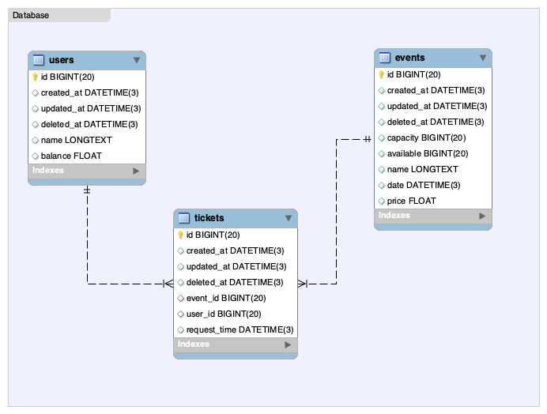
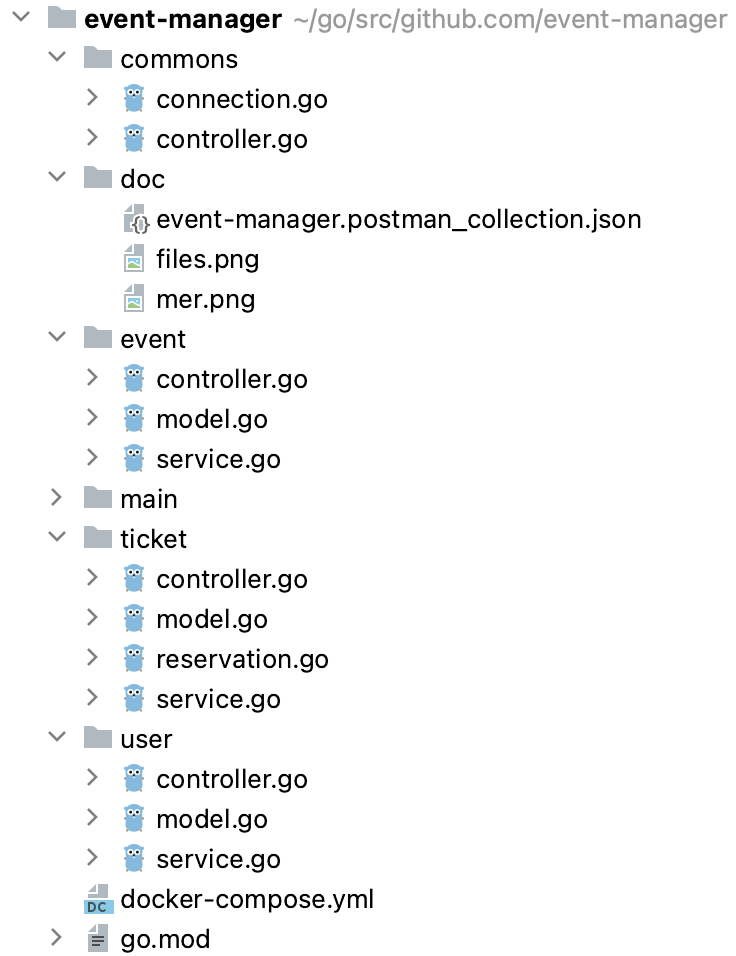

# back-end - App para criar tickets em eventos

> O objetivo desta app é explorarmos as facilidades do golang
> para criações de apps de back-end :)
> Build fast, reliable, and efficient software at scale

#### Ferramentas
- Go - Golang
- Mysql
- Backend
- Gorm / Gin
- Docker compose
- Postman

### Funcionalidades

- Cria / Lista - Usuários
- Cria / Lista - Eventos
- Cria / Lista - Tickets

### Regras de negócio

- Não se pode criar um evento com data retroativa
- Um usuário pode comprar apenas um ticket por evento
- O usuário deve ter saldo maior que o valor do ticket do evento
- Não pode exceder tickets a mais que a capacidade do evento

### Instruções para testar

- 1 - Inicie o docker
- 2 - Sugiro importar o projeto com o Goland
- 3 - Na raiz do projeto execute: `docker-compose up -d`
- 4 - Vá até o arquivo `main/main.go` clique no `botão direito` e depois em `debug`
- 5 - Importe a coleção do postam na pasta `docs`
- 6 - Crie na sequência um Usuário, um evento
- 7 - No list Recupere os ids (usuário e evento) e crie um Ticket

### Conceitos

| Nome | Detalhe |
| ------ | ------ |
| Anti-corruption layer | Nas apis rest, é trafegado uma estrutura diferente dos modelos do domínio |
| ORM | Usa framework para traduzir modelos em instruções sql no mysql|
| Migrate | Cria a base de dados e as tabelas no início da app |
| Transação | Multiplas instruções sql garantidas em apenas uma transação (reservation) |

### Arquivos 

